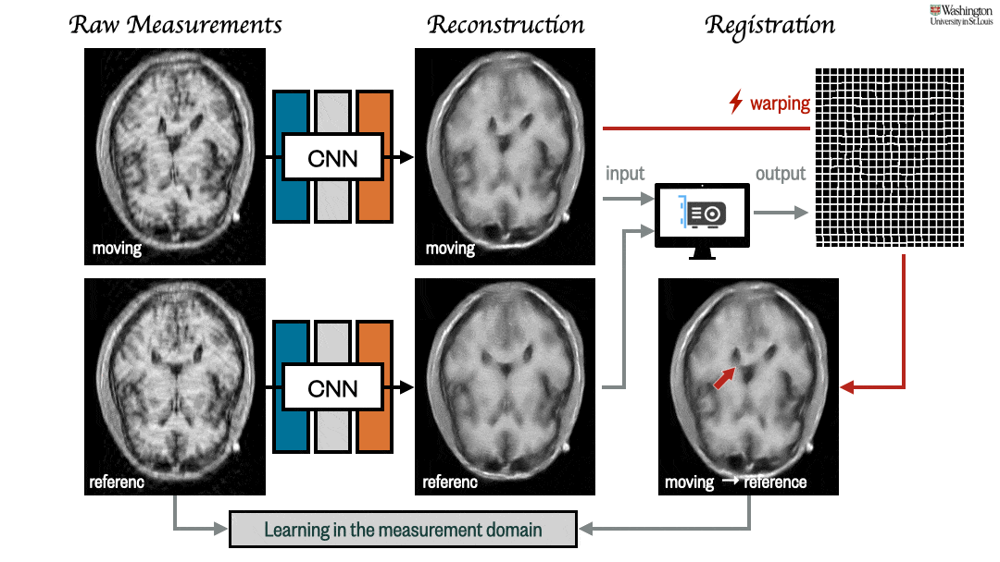
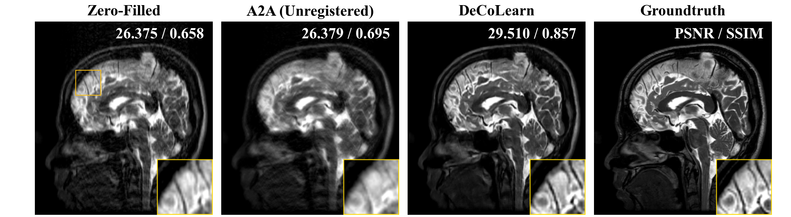

# DeCoLearn: Deformation-Compensated Learning (IEEE Transactions on Medical Imaging, 2022)

This is the official repository of [Deformation-Compensated Learning for Image Reconstruction without Ground Truth](https://ieeexplore.ieee.org/document/9743932).



## Abstract
Deep neural networks for medical image reconstruction are traditionally trained using high-quality ground-truth images as training targets. Recent work on Noise2Noise (N2N) has shown the potential of using multiple noisy measurements of the same object as an alternative to having a ground-truth. However, existing N2N-based methods are not suitable for learning from the measurements of an object undergoing nonrigid deformation. This paper addresses this issue by proposing the deformation-compensated learning (DeCoLearn) method for training deep reconstruction networks by compensating for object deformations. A key component of DeCoLearn is a deep registration module, which is jointly trained with the deep reconstruction network without any ground-truth supervision. We validate DeCoLearn on both simulated and experimentally collected magnetic resonance imaging (MRI) data and show that it significantly improves imaging quality.

## Code

### Download datasets

- Download the brain mri dataset [here](https://drive.google.com/file/d/1qp-l9kJbRfQU1W5wCjOQZi7I3T6jwA37/view) and put it into the `decolearn/dataset` folder.


### Setup Environment
Setup the environment
```
conda env create -n decolearn_env --file decolearn.yml
```
To activate this environment, use
```
conda activate decolearn_env
```
To deactivate an active environment, use
```
conda deactivate
```

### Run
Enter the decolearn folder
```
cd ./decolearn
```

Use the following command to run DeCoLearn
```
python main.py --gpu_index=0 --is_optimize_regis=true
```


Use the following command to run A2A (Unregistered)
```
python main.py --gpu_index=0 --is_optimize_regis=false
```

The training and testing will be conducted sequentially.

Please specify the GPU index (i.e., --gpu_index) based on your resources. No multi-gpu support so far.

### Results
Outputs can be found in `decolearn/experimental_results/`

#### Visual Examples




#### Quantitative Evaluation

|      | Zero-Filled | A2A (Unregistered) | DeCoLearn |
|:----:|:-----------:|:------------------:|:---------:|
| PSNR |    27.85    |       26.48        | **31.87** |
| SSIM |    0.694    |       0.708        | **0.861** |

## Citation

```
@article{gan2021deformation,
  title={Deformation-Compensated Learning for Image Reconstruction without Ground Truth},
  author={Gan, Weijie and Sun, Yu and Eldeniz, Cihat and Liu, Jiaming and An, Hongyu and Kamilov, Ulugbek S},
  journal={IEEE Transactions on Medical Imaging},
  year={2022}
}
```

It is worth mentioning that the brain mri data used in this repo is provided by [here](https://github.com/hkaggarwal/modl). Please consider also cite their paper.

## Supplementary Materials

In this repo, we provide [a supplementary document](./file/supplemental_documents.pdf) showing (a) an illustration of simulated sampling masks, (b) validation with additional levels of deformation, (c) validation with additional sub-sampling rates, (d) an illustration of the influence of the trade-off parameter in Equ. (10) of the paper, and (e) validation on MRI measurements simulated using complex-value ground-truth images.
